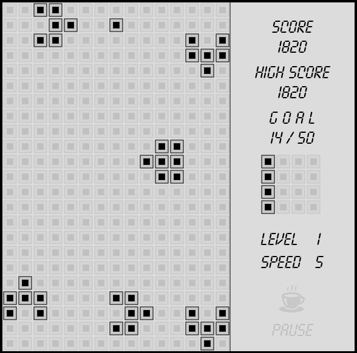

# Tanks_Brick_Game
An open source 2D game in which the player is the controller of a fighting tank, traversing
in all directions to collect maximum points while shooting the enemy tanks.

Game can be played using 'W', 'S', 'A', 'D'.
Goal and score is given in right side panel.
Goal has to be completed to move next level.
Game can be paused/resumed using enter key.

Home page of the game where you can change level and/or speed.
Use 'W' to change levels and 'D' to change speed.

You can move your tank using w,a,s,d keys and fire bullets using space.

